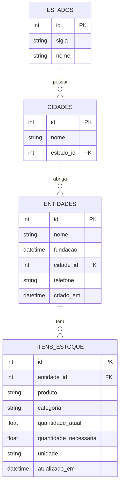

# Estoque Solidário
- Portal foi pensado para que entidades beneficentes cadastrem itens necessários, divulguem estoques atuais e níveis ideais, enquanto doadores consultam essas informações de forma prática e objetiva.


## Para rodar o projeto como desenvolvedor:
1. Instale uma versão de python (preferencialmente >= 3.13, < 4.0);
2. Instale o `pipx`:
```bash
pip install pipx
```
3. Instale o `poetry` usando o `pipx`:
```bash
pipx install poetry
```
4. Crie uma pasta `.venv` na raiz de seu projeto ou rode o comando abaixo. Essa pasta abrigará seu ambiente virtual.
```bash
poetry config virtualenvs.in-project true --local
```
- Caso prefira que essa configuração seja aplicada globalmente:
```bash
poetry config virtualenvs.in-project true
```
5. Instale a aplicação:
```bash
poetry install
```
6. Crie um arquivo `.env` na raiz do projeto contendo as seguintes variáveis de ambiente:
```
DB_USER=seu_usuario
DB_PASSWORD=sua_senha
```
7. Instale o banco de dados [postgre](https://www.postgresql.org/download/).
8. Rode a aplicação:
```bash
poetry run fastapi dev main.py
```
⚠️ A aplicação não estará funcionando completamente. Crie as tabelas necessárias no banco e popule usando a consulta citada abaixo.

## Banco de dados
- Rode o script em `create_base.py` para criar as tabelas no banco de dados (postgre).
- Na pasta `queries`, há uma consulta SQL criadas para popular preliminarmente.
  - Rode elas usando o terminal ou o [pgAdmin](https://www.pgadmin.org/).
  - Rode as queries na seguintes sequência: `estados_insert.sql`, `cidades_insert.sql` e `entidades_insert.sql`.

### Diagrama ER

